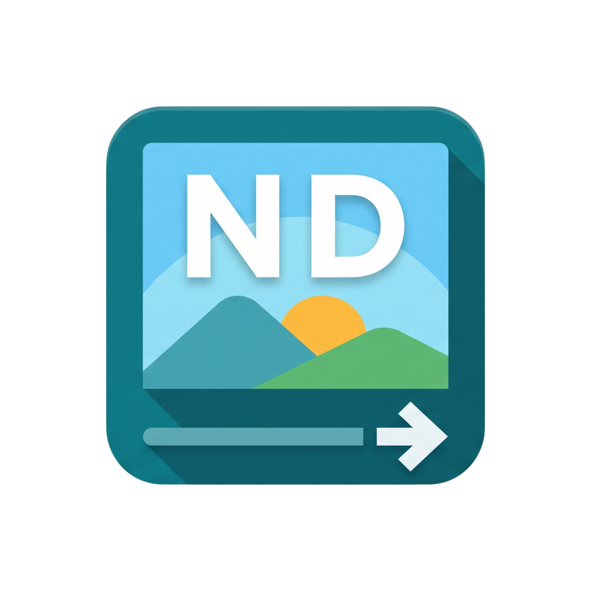

# ND Image Converter

**Blazing-fast, privacy-first, offline batch image converter & optimizer for desktop.**


---
<p align="center">
  <a href="[https://github.com/duongtruongdp/ND-ImgConverter]"></a>
</p>

## ⚡ Overview

**ND Image Converter** is a modern, lightweight desktop utility designed for creators, photographers, and developers who need high-throughput image conversion without sacrificing privacy or speed.

Built with **Tauri 2**, **React**, and a multi-threaded **Rust processing engine**, it runs 100% offline directly on your machine.

---

## ✨ Features (v0.1)

- 🔒 **100% Offline & Private:** No cloud uploads, no telemetry, no tracking.
- ⚡ **Multi-threaded Engine:** Powered by Rust and `rayon` for fast batch processing on multi-core CPUs (Apple Silicon & Intel/AMD).
- 🖼 **Formats Supported:** Fast decoding and encoding between **JPG/JPEG**, **PNG**, and **WebP**.
- 🎯 **Smart Resize Options:**
  - Original dimensions
  - Fixed Width (with aspect-ratio preservation)
  - Percentage Scaling
- 🎚 **Precision Quality Control:** Fine-tune compression ratio for JPEG and WebP.
- 🚀 **Fast Async Metadata & Thumbnails:** Instant thumbnail previews even when dropping dozens of 4K images.
- 📂 **Flexible Output Management:** Save next to source files or select a custom output directory.
- 🖥 **Native macOS Experience:** Frameless window design with system traffic lights, drag-and-drop, and Finder integration.

---

## 🛠 Tech Stack

- **Desktop Framework:** [Tauri 2](https://tauri.app/)
- **Core Processing Engine:** [Rust](https://www.rust-lang.org/) (`image`, `rayon`, `webp`, `tokio`)
- **Frontend Framework:** [React](https://react.dev/) + [TypeScript](https://www.typescriptlang.org/) + [Vite](https://vitejs.dev/)
- **Styling:** [Tailwind CSS v4](https://tailwindcss.com/)
- **State Management:** [Zustand](https://github.com/pmndrs/zustand)
- **Icons:** [Lucide React](https://lucide.dev/)

---

## 🚀 Getting Started

### Prerequisites

Ensure you have the following installed on your machine:

1. **Node.js:** v18.0 or newer
2. **Rust & Cargo:** Stable toolchain via `rustup`
3. **Xcode Command Line Tools** (for macOS):
   ```bash
   xcode-select --install
   ```

## ✨ Installation & Development
1. Clone the repository:
   ```bash
   git clone https://github.com/duongtruongdp/ND-ImgConverter.git
   cd ND-ImgConverter
   ```
2. Install dependencies:
   ```bash
   npm install
   ```
3. Run in development mode:
   ```bash
   npm run tauri dev
   ```

## 📦 Building for Production
To create an optimized production release (.dmg / .app on macOS, .msi / .exe on Windows):
  ```bash
  npm run tauri build
  ```
The output installation files will be available in:
- **macOS:** src-tauri/target/release/bundle/dmg/
- **Windows:** src-tauri/target/release/bundle/msi/

## 🛠️ Troubleshooting

### Q&A

**Question**: Why does macOS say "The application can't be opened"?
macOS Gatekeeper may block apps downloaded from the internet. Try these fixes:

- Method 1 (Recommended): Open Terminal and run
```
xattr -cr /Applications/ND Image Converter.app
```
- Method 2: Right-click the app -> select "Open" -> click "Open" in the dialog.

- Method 3: Go to System Settings -> Privacy & Security -> scroll down and click "Open Anyway".

**Question**: Why does Windows show "Windows protected your PC"?
This SmartScreen warning appears because ND Image Converter isn't code-signed yet. Code signing certificates cost $400+/year, which isn't feasible for a free project at this stage.

To install safely:

- Click "More info" on the warning dialog
- Click "Run anyway"
ND Image Converter is 100% free with premium features — download from GitHub and verify it runs completely offline.


## 🗺 Roadmap
[x] v0.1: Core Engine, Batch Conversion (JPG/PNG/WebP), Fast Thumbnails, Native Drag & Drop.

[x] v0.2: Split-screen Before/After Image Comparison Slider, Presets Manager, Keyboard Shortcuts.

[x] v0.3: Support 50+ inputs (including HEIC/RAW/SVG) and 19 modern output formats with dark minimalist UI.

[x] v0.4: Live Watch Folder automation, ICC color management, instant output size estimation, and pixel-level comparison inspection.

[ ] v0.5:

[ ] v1.0:

## 📄 License
This project is licensed under the MIT License - see the LICENSE file for details.
